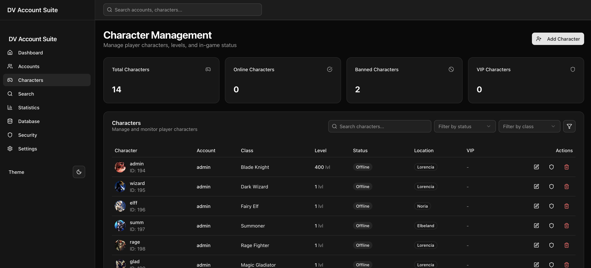

# DV Account Suite - MUonline Server Management

A modern web-based account management system for MUonline private servers with a beautiful dashboard UI, dark mode support, and SQL database integration.



## Credits

- DVTeam for providing the emulator
- SkillRO for providing insight into item structure

## Features

- 🎨 **Modern UI** - Built with shadcn/ui components and Tailwind CSS
- 🌙 **Dark Mode** - Full dark/light mode support with system preference detection
- 📊 **Dashboard** - Comprehensive overview with statistics and recent activity
- 👥 **Account Management** - Create, edit, delete, and manage player accounts
- 🎮 **Character Management** - View and manage player characters
- 🔍 **Search & Filter** - Advanced search and filtering capabilities
- 🛡️ **Security** - Account status management (active, banned, VIP)
- 📱 **Responsive** - Mobile-friendly design
- 🗄️ **SQL Integration** - Direct MySQL database connectivity

## Tech Stack

- **Framework**: Next.js 16 with App Router
- **UI Components**: shadcn/ui
- **Styling**: Tailwind CSS
- **Database**: MySQL with mysql2
- **Icons**: Lucide React
- **Theme**: next-themes for dark mode

## Getting Started

### Prerequisites

- Node.js 18+ 
- MySQL database with MUonline tables
- npm or yarn package manager

### Installation

1. **Clone the repository**
   ```bash
   git clone <repository-url>
   cd DV-Account-Suite
   ```

2. **Install dependencies**
   ```bash
   npm install
   ```

3. **Set up environment variables**
   Create a `.env.local` file in the root directory:
   ```env
   DB_HOST=192.168.56.1
   DB_USER=root
   DB_PASSWORD=1234
   DB_NAME=muonline
   DB_PORT=3306
   ```
   
   **Note**: The application is configured to connect to a MariaDB database at `192.168.56.1:3306` with the database name `muonline`. Update these values in your `.env.local` file to match your database setup.

4. **Configure your MariaDB database**
   Ensure your MUonline database has the following tables:
   - `accounts` - Account information (with columns: id, username, email, status, vip)
   - `character` - Character data

5. **Run the development server**
   ```bash
   npm run dev
   ```

6. **Open your browser**
   Navigate to [http://localhost:3000](http://localhost:3000)

## License

This project is licensed under the MIT License - see the LICENSE file for details.

## Support

For support and questions, please open an issue on the GitHub repository.
